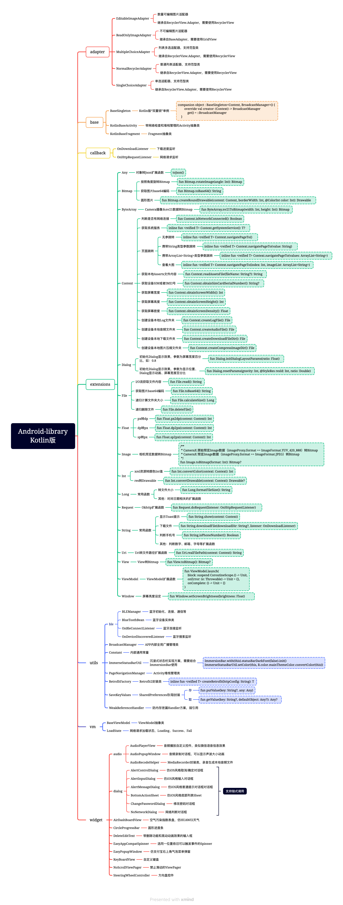

# Kotlin-lite-lib

Android依赖库，Android-library升级Kotlin版。

## 使用说明

### 引入方式
#### 最新版本: [](https://jitpack.io/#AndroidCoderPeng/Kotlin-lite-lib)

#### 1、通过gradle引入

在APP的build.gradle中添加如下代码块：

```gradle
dependencies {
    //基础依赖库
    implementation 'com.github.AndroidCoderPeng:Kotlin-lite-lib:latest.integration'
}
```

2、最后点击Sync同步一下就可以用了。

### 部分模块使用例子

#### adapter包

##### 普通列表

```kotlin
val homeAdapter = object : NormalRecyclerAdapter<String>(
    R.layout.item_home_rv_g, LocaleConstant.HOME_FUNC_OPERATE.toList()
) {
    override fun convertView(viewHolder: ViewHolder, position: Int, item: String) {
        viewHolder.setImageResource(
            R.id.functionImageView, LocaleConstant.HOME_FUNC_IMAGE[position]
        ).setText(R.id.homeFunctionView, item)
    }
}
homeFuncRecyclerView.adapter = homeAdapter
```

##### 单选列表

```kotlin
val selectCustomerAdapter = object :
    SingleChoiceAdapter<CustomerListModel.DataModel.RowsModel>(
        R.layout.item_select_customer_lv, dataBeans
    ) {
    override fun convertView(
        viewHolder: ViewHolder, position: Int, item: CustomerListModel.DataModel.RowsModel
    ) {
        viewHolder.setText(R.id.xxxx, item.xxxxx)
    }
}
customerRecyclerView.adapter = selectCustomerAdapter
```

##### 多选列表

```kotlin
val selectSampleAdapter = object :
    MultipleChoiceAdapter<SampleListModel.DataModel.RowsModel>(
        R.layout.item_select_sample_lv, dataBeans
    ) {
    override fun convertView(
        viewHolder: ViewHolder, position: Int, item: SampleListModel.DataModel.RowsModel
    ) {
        viewHolder.setText(R.id.xxxx, item.xxxxx)
    }
}
sampleRecyclerView.adapter = selectSampleAdapter
```

#### base包

```kotlin
companion object : BaseSingleton<Context, BroadcastManager>() {
    override val creator: (Context) -> BroadcastManager
        get() = ::BroadcastManager
}
```

#### extensions包

```kotlin
//在Activity跳转其他页面
navigatePageTo<MainActivity>()

//非Activity跳转其他页面
requireContext().navigatePageTo<TestActivity>()

//查看大图
requireContext().navigatePageTo<BigImageActivity>(0, urls)

//读取本地assets资源
val countryCode = readAssetsFile("CountryCode.json")

//颜色资源xml专为Color
R.color.hintColor.convertColor(requireContext())

//根据url下载文件或者图片，并带有下载进度
url.downloadFile(createDownloadFileDir().toString(),
    object : OnDownloadListener {
        override fun onDownloadStart(totalBytes: Long) {
            runOnUiThread {
                LoadingDialogHub.show(this@PreviewTextActivity, "附件加载中")
            }
        }

        override fun onProgressChanged(currentBytes: Long) {

        }

        override fun onDownloadEnd(file: File?) {
            runOnUiThread {
                LoadingDialogHub.dismiss()
                textView.text = file?.read()
            }
        }
    })

//Toast
"输入错误，请检查！".show(requireContext())

//Uri转绝对路径，兼容Android 10以上，采用沙盒方式
val filePath = uri?.realFilePath(requireContext())
```

#### utils包

```kotlin
//ble封装，1、扫描设备 2、配对设备 3、解除设备配对 4、连接设备 6、发现服务 7、打开读写功能 8、数据通讯（发送数据、接收数据） 9、断开连接
//例子：略

//Activity管理
PageNavigationManager.addActivity(this)
PageNavigationManager.finishAllActivity()

//RetrofitFactory
private val api by lazy {
    val httpConfig = SaveKeyValues.getValue(
        LocaleConstant.DEFAULT_SERVER_CONFIG, LocaleConstant.SERVER_BASE_URL
    ) as String
    RetrofitFactory.createRetrofit<RetrofitService>(httpConfig)
}

//SharedPreferences
SaveKeyValues.putValue("keyString", key)
SaveKeyValues.getValue("token", "") as String?
SaveKeyValues.removeKey("token")

//避免内存泄漏的Handler
private val weakReferenceHandler: WeakReferenceHandler
weakReferenceHandler = WeakReferenceHandler { msg ->
    if (msg.what == 2022061201) {

    }
    true
}
```

### dialog包
```kotlin
AlertControlDialog.Builder()
    .setContext(requireContext())
    .setTitle("退出登录")
    .setMessage("确定要退出吗？")
    .setNegativeButton("取消")
    .setPositiveButton("确定")
    .setOnDialogButtonClickListener(object : AlertControlDialog.OnDialogButtonClickListener {
        override fun onConfirmClick() {
            loginViewModel.out()
        }

        override fun onCancelClick() {

        }
    }).build().show()
```

其他的就不一一列举了，有用得到的可以自己试试~~~

详细功能架构图如下所示：

